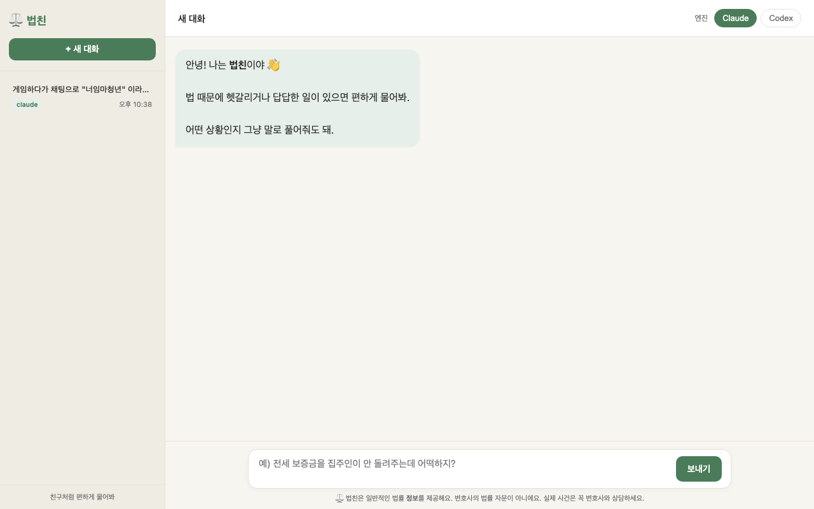

# 법친 (Beopchin)

> 친구처럼 편한 한국어 AI 법률 친구. 대법원 판례를 검색해서 근거와 함께 답해줍니다.



법친은 **내 컴퓨터에서 직접 돌아가는** 프로그램이에요. 질문 내용이 외부 서버로 따로 저장되지 않고, 평소 쓰던 **Claude** 또는 **Codex** CLI를 그대로 사용합니다.

> ⚠️ 법친이 주는 답은 **일반적인 법률 정보**예요. 변호사의 법률 자문이 아니니, 실제 사건은 꼭 변호사와 상담하세요.

---

## 필요한 환경

법친을 돌리려면 두 가지가 미리 깔려 있어야 해요.

1. **Go 1.21 이상** — 법친 본체를 빌드하는 데 필요해요.
2. **Claude CLI** 또는 **Codex CLI** 중 하나 — 실제로 답을 생성하는 AI 엔진이에요. 둘 다 있어도 좋고, 화면에서 골라 쓸 수 있어요.
   - Claude CLI: <https://docs.claude.com/en/docs/claude-code>
   - Codex CLI: <https://github.com/openai/codex>

법친은 사용자가 이미 로그인해 둔 CLI를 그대로 실행해서 답을 받아와요. 별도의 API 키를 법친에 넣을 필요는 없어요.

---

## 설치하기

### 🍎 macOS

터미널을 열고 아래 명령을 순서대로 실행하세요.

```bash
# 1. Go 설치 (이미 있다면 건너뛰기)
brew install go

# 2. 법친 내려받기
git clone https://github.com/grayhh/law-friend.git
cd law-friend

# 3. 판례 데이터 다운로드 (약 254MB) → data/precedents.json 위치에 저장
mkdir -p data
curl -L -o data/precedents.json \
  https://github.com/grayhh/law-friend/releases/latest/download/precedents.json

# 4. 빌드 + 실행
go build -o beopchin .
./beopchin serve
```

`brew`가 없다면 먼저 [Homebrew](https://brew.sh)부터 설치하세요.

### 🪟 Windows

PowerShell을 열고 아래를 따라 하세요.

```powershell
# 1. Go 설치 (이미 있다면 건너뛰기)
#    https://go.dev/dl/ 에서 Windows용 MSI 인스톨러를 받아 설치하세요.
#    설치 후 PowerShell을 새로 열어야 go 명령이 인식돼요.

# 2. 법친 내려받기
git clone https://github.com/grayhh/law-friend.git
cd law-friend

# 3. 판례 데이터 다운로드 (약 254MB)
New-Item -ItemType Directory -Force data | Out-Null
Invoke-WebRequest `
  -Uri "https://github.com/grayhh/law-friend/releases/latest/download/precedents.json" `
  -OutFile "data\precedents.json"

# 4. 빌드 + 실행
go build -o beopchin.exe .
.\beopchin.exe serve
```

`git`이 없다면 [Git for Windows](https://git-scm.com/download/win)를 먼저 설치하거나, GitHub에서 ZIP으로 받아 압축을 풀어도 돼요.

---

## 사용하기

1. 위 단계로 서버를 띄우면 터미널에 이렇게 뜹니다.
   ```
   법친이 준비됐어요! → http://localhost:8787
   ```
2. 브라우저에서 **<http://localhost:8787>** 을 열면 채팅 화면이 나와요.
3. 오른쪽 위에서 **엔진(Claude / Codex)** 을 골라요.
4. 아래 입력칸에 평소 말투로 질문을 던지면 됩니다.

   > 예) "전세 보증금을 집주인이 안 돌려주는데 어떡하지?"

5. 답변 아래에 **📚 참고 판례** 가 같이 표시돼요. 사건번호를 누르면 원문을 볼 수 있어요.

서버를 끄려면 터미널에서 `Ctrl + C` 를 누르세요.

---

## 대화 기록은 어디에 저장돼요?

전부 내 컴퓨터 안에만 있어요. 외부로 나가지 않습니다.

- **macOS**: `~/.beopchin/sessions.json`
- **Windows**: `%USERPROFILE%\.beopchin\sessions.json`

대화를 지우고 싶다면 이 파일을 지우면 돼요.

---

## 문제가 생겼을 때

| 증상 | 해결 |
|------|------|
| `command not found: go` | Go가 설치되지 않았거나 PATH에 없어요. 터미널을 새로 열어보세요. |
| `claude/codex CLI를 찾을 수 없어요` | 해당 CLI가 설치돼 있고 `claude --version` / `codex --version` 이 동작하는지 확인하세요. |
| 8787 포트가 이미 쓰여요 | 다른 프로그램이 사용 중이에요. 그 프로그램을 끄거나, 법친을 다시 실행하세요. |
| 검색 결과가 이상해요 | `data/precedents.json` 파일이 있는지 확인하세요. 없다면 저장소를 다시 받아주세요. |

---

## 데이터 출처

- 국가법령정보센터 Open API (<https://www.law.go.kr>)
- 대법원 판례 약 1만 4천여 건 (2016~2025년 선고분)

---

## 라이선스

이 프로젝트는 개인적·학습 목적으로 자유롭게 쓸 수 있어요. 상업적 이용 전에는 데이터 출처(국가법령정보센터)의 이용 약관을 꼭 확인하세요.
